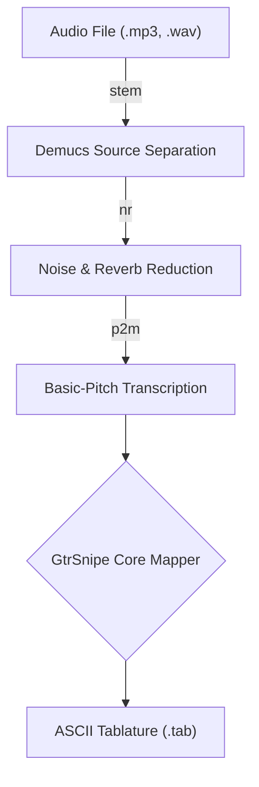

# gtrsnipe 
(pronounced "guttersnipe")

## v1.1
Convert to and from .mid, .abc, .vex, and .tab files. 

## V2.0
Transcribe music for guitar, capable of converting audio files (.mp3, .wav), MIDI (.mid), and various text-based formats (.tab, .vex, .abc) into high-quality ASCII tablature.

### What?

gtrsnipe is a versatile music transcription tool. Its primary function is to create playable guitar tablature from a variety of sources. It features a sophisticated audio-to-tab pipeline that can take a mixed audio track, isolate the guitar part, and transcribe it into a tab.

It can also convert existing MIDI files into text-based notations or, in reverse, generate a playable MIDI file from a text-based tab.

At its core, gtrsnipe uses an intelligent fretboard mapper that analyzes notes and chords to find comfortable and logical fingerings on the guitar neck. This process is highly customizable, allowing you to fine-tune the output to match your personal playing style and preferences.

-----
## The Audio-to-Tablature Pipeline

For audio files, gtrsnipe uses a multi-stage pipeline to process the sound and transcribe the notes. Each stage can be enabled or disabled via command-line flags.



---

# Installation

### Prerequisites

You must have a working Python programming language environment installed (from python.org or your system's software package manager) as well as `git` (from git-scm.com or your system's software package manager.)

### Procedure

It is highly recommended to install gtrsnipe within a python virtual environment.

```
git clone https://github.com/scottvr/gtrsnipe
cd gtrsnipe
python -mvenv .venv
```
Activate the environment:

on Windows: `.venv\Scripts\activate`
on MacOS/Linux: `. .venv/bin/activate`

Then, install the project and its dependencies:

```
pip install -e .
```

## Usage 

The installation process makes gtrsnipe available as a command within your activgated virtual environment.

### Command-line help

```
usage: gtrsnipe [-h] [--nudge NUDGE] [-y] [--track TRACK]
                [--constrain-pitch] [--pitch-mode {drop,normalize}]
                [--transpose TRANSPOSE] [--no-articulations] [--staccato]
                [--max-line-width MAX_LINE_WIDTH] [--bass]
                [--num-strings {4,5,6,7}] [--single-string {1,2,3,4,5,6}]
                [--debug] [--list-tunings] [--show-tuning TUNING_NAME]
                [--tuning {STANDARD, E_FLAT, DROP_D, ... ]
                [--max-fret MAX_FRET]
                input_file output_file
```

### Key arguments

**I/O Arguments**
- `-i, --input FILE`: Required. Path to the input file (.mp3, .wav, .mid, etc.).
- `-o, --output FILE`: Required. Path to save the output file (.tab, .mid, etc.).
- `-y, --yes`: Automatically overwrite the output file if it already exists.

**Audio Pipeline Arguments**
- `--stem`: Step 1: Enables source separation (Demucs) to isolate an instrument stem.
- `--nr`: Step 2: Enables noise/reverb reduction on the audio stem.
- `--p2m`: Step 3: Enables pitch-to-MIDI conversion on the audio stem.
- `--stem-name {guitar,bass,drums,vocals,other}`: The instrument stem to isolate with Demucs. 'guitar' defaults to the 'other' stem, which is often where guitars are found in a mix.
- `--demucs-model MODEL_NAME`: The Demucs model to use for separation (e.g., htdemucs, htdemucs_ft). See below for a full list.


**General Converstion Options**
- `--track TRACK`: The track number (1-based) to select from a multi-track MIDI file.
- `--transpose N`: Transpose the music up or down by N semitones.
- `--no-articulations`: Transcribe with no legato, taps, hammer-ons, etc.
- `--bass`: A shortcut for bass mode. Automatically uses bass tuning and a 4-string staff.
- `--tuning TUNING_NAME`: Specify the guitar tuning (e.g., DROP_D, E_FLAT). Use `--list-tunings` to see all available options and `--show-tuning TUNING_NAME` to see a specific tuning (mostly useful for automation/scripting)


## Usage Examples

**Full audio-to-tab transcription**

Run the complete pipeline on a mixed audio file to generate a tab tuned to Drop D.

`gtrsnipe -i x:\S.O.D.mp3 -o march_of_the_S.O.D.tab --bass --stem --stem-name bass --p2m --tuning DROP_D  -y`

**Audio-to-MIDI only**

Extract the guitar part from a song and save it as a MIDI file, stopping the pipeline there.

`gtrsnipe -i "another_song.wav" -o "guitar_part.mid" --stem --p2m`

**Transcribing from Clean Audio**

If you already have a clean, isolated guitar track, you can skip the demucs and noise reduction steps.

`gtrsnipe -i "my_clean_riff.wav" -o "my_riff.tab" --p2m`

**MIDI-to-Tab (Classic V1 Functionality)**

`gtrsnipe -i "MrCrowley.mid" -o "mrcrowley.tab" --track 5`

## Advanced Usage: Mapper & Demucs Tuning

The real power of gtrsnipe comes from its customizability. You can fine-tune the fretboard mapping algorithm and the audio separation models to get the perfect transcription. Detailed documentation with troubleshooting examples are being created [in the wiki.](https://github.com/scottvr/gtrsnipe/wiki/FretboardMapper-Algorithm-Configuration-and-Tunables)

**Fretboard Mapper Tuning**

These options tweak the algorithm that decides where to place notes on the virtual fretboard.

- `--sweet-spot-low N / --sweet-spot-high N`: Defines the fret range that is preferred, giving it a score bonus. Useful for forcing a transcription into a specific position on the neck.
- `--string-switch-penalty N`: Sets the "cost" of moving between strings. Lower this for pieces with lots of string-hopping.
- `--quantization-resolution N`: Crucial for audio transcription. Snaps notes to a time grid. A coarser value (e.g., 0.25) can clean up messy chords from a raw performance, while a finer value (e.g., 0.125) preserves fast, distinct notes.
- `--prefer-open`: Toggles a preference for using open strings over their fretted equivalents.
- ...and many more. Use `gtrsnipe -h` to see the full list of detailed penalties and thresholds.

**Demucs Model Selection** `(--demucs-model)`

Demucs is a state-of-the-art music source separation model. Several models are available, each with specific characteristics. Choosing the right one can significantly improve the quality of the isolated audio stem.

- **htdemucs**: The default Hybrid Transformer Demucs model. A great all-rounder.
- **htdemucs_ft**: A version of htdemucs fine-tuned on extra data. May offer better quality at the cost of speed.
- **htdemucs_6s**: A 6-source version that can additionally attempt to separate piano and guitar, though quality may vary.
- **hdemucs_mmi**: The v3 Hybrid Demucs model, retrained on more data.
- **mdx / mdx_extra**: Models known for high performance, trained on the MusDB HQ dataset.
- **mdx_q / mdx_extra_q**: Quantized (smaller, faster) versions of the mdx models, which may have slightly reduced quality.


### Current Supported Tunings

```
$ gtrsnipe  --list-tunings                                                   
Available Tunings:
- STANDARD              : E4 B3 G3 D3 A2 E2
- E_FLAT                : Eb4 Bb3 Gb3 Db3 Ab2 Eb2
- DROP_D                : E4 B3 G3 D3 A2 D2
- D_STANDARD            : D4 A3 F3 C3 G2 D2
- DROP_C                : D4 A3 F3 C3 G2 C2
- DROP_B                : C#4 F#3 B2 E2 B1
- OPEN_G                : D4 B3 G3 D3 G2 D2
- OPEN_E                : E4 B3 G#3 E3 B2 E2
- DADGAD                : D4 A3 G3 D3 A2 D2
- OPEN_D                : D4 A3 F#3 D3 A2 D2
- OPEN_C6               : E4 C4 G3 C3 A2 C2
- BASS_STANDARD         : G2 D2 A1 E1
- BASS_DROP_D           : G2 D2 A1 D1
- BASS_E_FLAT           : Gb2 Db2 Ab1 Eb1
- SEVEN_STRING_STANDARD : E4 B3 G3 D3 A2 E2 B1
- SEVEN_STRING_DROP_A   : E4 B3 G3 D3 A2 E2 A1
- BARITONE_B            : B3 F#3 D3 A2 E2 B1
- BARITONE_A            : A3 E3 C3 G2 D2 A1
- BARITONE_C            : C4 G3 Eb3 Bb2 F2 C2
```

### More Detailed (V1) Usage Examples  

Transcribing this organ intro for my classical guitar, where the "sweet spot" is lower on the neck:

```
$ gtrsnipe MrCrowleyOrganIntro.mid mrcrowley-organ.tab --track 5 --sweet-spot-high 8 --max-line-width 120
Converting 'MrCrowleyOrganIntro.mid' (mid) to 'mrcrowley-organ.tab' (tab)...
--- Selecting track 5 of 7 ---
--- Chord-Aware Mapper initialized. ---
Successfully saved to mrcrowley-organ.tab
```

That command extracts track 5 (the organ track) from a multi-track MIDI file found on the Internet, prefers frets between open and 8th when mapping notes to frets, and outputs the measures up to 120 characters per line. Here's what the output looks like:

```
// Title: MrCrowley-OrganIntro
// Tempo: 120.0 BPM
// Time: 4/4
// Tuning: STANDARD

e|-------------------|-----------------------|--1----------------|--3--------------------|--5----------------|
B|--6----------------|--5--------------------|--1----------------|--5--------------1---p0|--5----------------|
G|--7----------------|--5--------------------|--2-----0---h2----4|--5--------------------|--5-----4---h5----7|
D|--7---------------5|--7--------------7---p5|--3----------------|--5-----5--------------|--7----------------|
A|--5-----7---h8-----|--7-----7--------------|--3----------------|--3---------3----------|--7----------------|
E|-------------------|--5---------5----------|--1----------------|-----------------------|--5----------------|

e|--7-------------|-------------1--|--3----1----0----1|--5-------------|----------------|-------------------|
B|--8-------------|-------------1--|--3----1----0----1|--6-------------|--5-------------|--6----------------|
G|--9-------------|--5-----7-------|------------------|--7-------------|--6-------------|--7----------------|
D|--9----9--------|--7-----8----3--|--5----3----2----3|--7-------------|--------3---p2--|--7---------------5|
A|--7---------7---|----------------|------------------|----------------|----------------|--5-----7---h8-----|
E|----------------|--5-----6----1--|--3----1----0----1|--5-------------|----------------|-------------------|

e|-----------------------|--1----------------|--3--------------------|--5----------------|--7-------------|
B|--5--------------------|--1----------------|--5--------------1---p0|--5----------------|--8-------------|
G|--5--------------------|--2-----0---h2----4|--5--------------------|--5-----4---h5----7|--9-------------|
D|--7--------------7---p5|--3----------------|--5-----5--------------|--7----------------|--9----9--------|
A|--7-----7--------------|--3----------------|--3---------3----------|--7----------------|--7---------7---|
E|--5---------5----------|--1----------------|-----------------------|--5----------------|----------------|

e|-------------1--|--3----1----0----1|--5-------------|----------------|
B|-------------1--|--3----1----0----1|--6-------------|--5-------------|
G|--5-----7-------|------------------|--7-------------|--6-------------|
D|--7-----8----3--|--5----3----2----3|--7-------------|----------------|
A|----------------|------------------|----------------|----------------|
E|--5-----6----1--|--3----1----0----1|--5-------------|----------------|
```

When transcribing a bass part, pass the proper tuning and (optionally) the number of strings. Without these arguments, transcribing a bass part will work, but the mapper will transpose to guitar notes and display on six strings. You can simply pass the `--bass` option as a shortcut for 4-strings, standard bass tuning. Passing a --tuning BASS_* tuning will by default render your tab with four strings, but you can override this with `--num-strings 5`, for example.

```
$ gtrsnipe SmellsLikeTeenSpirit.mid --track 6 teenspirit-bass.tab --no-articulations --nudge 14 --tuning BASS_E_FLAT
Converting 'SmellsLikeTeenSpirit.mid' (mid) to 'teenspirit-bass.tab' (tab)...
--- Selecting track 6 of 11 ---
--- Nudging all events forward by 3.5 beats ---
--- Chord-Aware Mapper initialized. ---
Successfully saved to teenspirit-bass.tab

$ cat teenspirit-bass.tab
// Title: SmellsLikeTeenSpirit
// Tempo: 120.0 BPM
// Time: 4/4
// Tuning (High to Low): Gb2 Db2 Ab1 Eb1

G|----------------|----------------|----------------|----------------|----------------|----------------|
D|----------------|----------------|----------------|----------------|----------------|----------------|
A|----------------|----------------|----------------|----------------|----------------|----------------|
E|----------------|----------------|----------------|----------------|----------------|----------------|

G|---------------------------------|---------------------------------|---------------------------------|
D|---------------------------------|---------------------------------|---------------------------------|
A|------------------------2---2----|------------------------5---5----|------------------------2---2----|
E|--2----2--2----2--2--2----------2|--5----5--5----5--5--5----------5|--2----2--2----2--2--2----------2|

G|---------------------------------|---------------------------------|---------------------------------|
D|---------------------------------|---------------------------------|---------------------------------|
A|------------------------5---5----|------------------------2---2----|------------------------5---5----|
E|--5----5--5----5--5--5----------5|--2----2--2----2--2--2----------2|--5----5--5----5--5--5----------5|

G|---------------------------------|---------------------------------|-------------------------------|
D|---------------------------------|---------------------------------|-------------------------------|
A|------------------------2---2----|------------------------5---5----|------------------2---2---2---2|
E|--2----2--2----2--2--2----------2|--5----5--5----5--5--5----------5|--2---2---2---2----------------|
```

## Advanced Usage: Fretboard Mapper Tuning

The following options can be used to tweak the fretboard positioning/fingering algorithm:

```
Mapper Tuning/Configuration (Advanced):
  --tuning {STANDARD,E_FLAT,DROP_D,OPEN_G,BASS_STANDARD,BASS_DROP_D,BASS_E_FLAT,SEVEN_STRING_STANDARD,SEVEN_STRING_DROP_A,BARITONE_B,BARITONE_A,OPEN_C,OPEN_C6}
                        Specify the guitar tuning (default: STANDARD).
  --max-fret MAX_FRET   Maximum fret number on the virtual guitar neck
                        (default: 24).
  --fret-span-penalty FRET_SPAN_PENALTY
                        Penalty for wide fret stretches (default: 100.0).
  --movement-penalty MOVEMENT_PENALTY
                        Penalty for hand movement between chords (default:
                        3.0).
  --string-switch-penalty STRING_SWITCH_PENALTY
                        Penalty for switching strings (default: 5.0).
  --high-fret-penalty HIGH_FRET_PENALTY
                        Penalty for playing high on the neck (default: 5).
  --low-string-high-fret-multiplier LOW_STRING_HIGH_FRET_MULTIPLIER
                        Multiplier penalty for playing high on the neck on low
                        strings (default: 10).
  --unplayable-fret-span UNPLAYABLE_FRET_SPAN
                        Fret span considered unplayable (default: 4).
  --sweet-spot-bonus SWEET_SPOT_BONUS
                        Bonus for playing in the ideal lower fret range. (default 0.5)
sweet-spot-low SWEET_SPOT_LOW
                        Lowest fret of the "sweet spot" (default 0 - open)
  --sweet-spot-high SWEET_SPOT_HIGH
                        Highest fret of the "sweet spot" (default 12)
  --ignore-open         Don't consider open when calculating shape score.
  --dedupe                  Enable de-duplication of notes with the same pitch
                              within a chord (drops duplicates).  
  --quantization-resolution {0.0625,0.125,0.25,0.5,1.0}
                              Quantization resolution for grouping simultaneous
                              notes (default: 0.125).  
  --prefer-open             Prefer open strings over fretted equivalents.
  --fretted-open-penalty F
                              Penalty for choosing a fretted note when an open
                              string is available (default: 20.0).  
  --legato-time-threshold LEGATO_TIME_THRESHOLD
                        Max time in beats between notes for a legato phrase
                        (For h/p when infer articulation is enabled (default)) (default: 0.5).
  --tapping-run-threshold TAPPING_RUN_THRESHOLD
                        Min number of notes in a run to be considered for
                        tapping (when infer articulation is enabled (default)) (default: 2).    
```

`--debug` can be used to show the scoring calculations to gain understanding of how your tweaks affect the results.

### Effects of mapper tunables

`--ignore-open` can make a surprising amount of difference without having to tweak scoring weights.
Compare the first few measures of MrCrowley from earlier:

Normal transcription:
```
e|-------------------|-----------------------|--1----------------|--3--------------------|--5----------------|
B|--6----------------|--5--------------------|--1----------------|--5--------------1---p0|--5----------------|
G|--7----------------|--5--------------------|--2-----0---h2----4|--5--------------------|--5-----4---h5----7|
D|--7---------------5|--7--------------7---p5|--3----------------|--5-----5--------------|--7----------------|
A|--5-----7---h8-----|--7-----7--------------|--3----------------|--3---------3----------|--7----------------|
E|-------------------|--5---------5----------|--1----------------|-----------------------|--5----------------|
```

with `--ignore-open`:
```
e|--1----------------|--0--------------------|--1----------------|--3--------------------|--5----------------|
B|--3----------------|--1--------------------|--1----------------|--5--------------1---p0|--5----------------|
G|--2----------------|--2--------------2---p0|--2-----0---h2----4|--5--------------------|--5-----4---h5----7|
D|--0-----2---h3----5|--2-----2--------------|--3----------------|--5-----5--------------|--7----------------|
A|-------------------|--0---------0----------|--3----------------|--3---------3----------|--7----------------|
E|-------------------|-----------------------|--1----------------|-----------------------|--5----------------|
```


If you know you want to play a piece in a certain position, tweak the "sweet spot". For example is a  transcription of a Bach Cello piece, Suite No. 1 in G major - BWV 1007 (Prelude), check out this section:

```
e|------------------------------------------------|
B|------------------------------------------------|
G|------------------------------------------------|
D|--------4--6--7--4--------------4--6--7--4--1---|
A|--0--4--------------4--2--0--4-----------------4|
E|------------------------------------------------|

e|------------------------------------------------|
B|------------------------------------------------|
G|------------------------------------------------|
D|------------------------------------------------|
A|--3--6--3--6--9--6--9--6--3--6--3--6--9--6--9--6|
E|------------------------------------------------|

e|------------------------------------------------|
B|------------------------------------------------|
G|------------------------------------------------|
D|------------------------------------------------|
A|--7--6--4--7--6--7--9--6--7--6--4--2--0---------|
E|-----------------------------------------4--2--0|
```

The default scoring doesn't work perfectly for this piece, imo. To my ears and hands, there is too much playing on a single string, and on my classical guitar, those 3-6-9 fret spans are impossible for me to play comfortably. So, let's remove the penalty for switching strings and see what happens to that `3-6-3-6-9 ...` measure:

```
e|------------------------------------------------|
B|------------------------------------------------|
G|------------------------------------------------|
D|--------------4-----4-----------------4-----4---|
A|-----6-----6-----6-----6-----6-----6-----6-----6|
E|--8-----8-----------------8-----8---------------|
```

OK, that's better; a little easier to fret, but it is bit high up on the neck for my taste. Let's try tweaking the default "sweet-spot" from the first 12 frets, to just the first four frets plus the open string.

with `--sweet-spot-low 0`, `--sweet-spot-high 4`, and `--string-switch-penalty 0`,
the measure comes out exactly how I would have transcribed it manually:
```
e|------------------------------------------------|
B|------------------------------------------------|
G|------------------------------------------------|
D|-----1-----1--4--1--4--1-----1-----1--4--1--4--1|
A|--3-----3-----------------3-----3---------------|
E|------------------------------------------------|
```

Here is the full command-line use to get this full transcription:
```
$ gtrsnipe csx.mid csx.tab --string-switch-penalty 0 --no-articulations --sweet-spot-high 4 -y 
$ cat ./csx.tab

e|------------------------------------------------|
B|------------------------------------------------|
G|--------1-----1-----1-----------1-----1-----1---|
D|-----------4-----------------------4------------|
A|-----2-----------2-----2-----2-----------2-----2|
E|--0-----------------------0---------------------|

e|------------------------------------------------|
B|------------------------------------------------|
G|--------2--1--2-----2-----------2--1--2-----2---|
D|------------------------------------------------|
A|-----4-----------4-----4-----4-----------4-----4|
E|--0-----------------------0---------------------|

e|------------------------------------------------|
B|------------------------------------------------|
G|--------2--1--2-----2-----------2--1--2-----2---|
D|-----1-----------1-----1-----1-----------1-----1|
A|------------------------------------------------|
E|--0-----------------------0---------------------|

e|------------------------------------------------|
B|------------------------------------------------|
G|--------1-----1-----1-----------1-----1-----1---|
D|-----2-----4-----2-----2-----2-----4-----2-----1|
A|------------------------------------------------|
E|--0-----------------------0---------------------|

e|------------------------------------------------|
B|------------------------------------------------|
G|--------1-----1---------------------------------|
D|-----------4-----2--1--2-----2--1--2------------|
A|-----4--------------------4--------------2--1---|
E|--0-----------------------------------4--------4|

e|------------------------------------------------|
B|------------------------------------------------|
G|------------------------------------------------|
D|-----2--4--2--4--2--4--2-----2--4--2--4--2--4--2|
A|--1-----------------------1---------------------|
E|------------------------------------------------|

e|------------------------------------------------|
B|------------------------------------------------|
G|--------4--3--4---------------------------------|
D|--1--4-----------4--2--4--1--4--2--4-----1------|
A|--------------------------------------2-----4--2|
E|------------------------------------------------|

e|------------------------------------------------|
B|------------------------------------------------|
G|------------------------------------------------|
D|--------2--1--2-----2-----------2--1--2-----2---|
A|--4-----------------------4---------------------|
E|-----4-----------4-----4-----4-----------4-----4|

e|------------------------------------------------|
B|------------------------------------------------|
G|-----------------------------------4--3--1------|
D|--------------------------2--1--------------4--2|
A|--4--1--2--4--2--1--------------4---------------|
E|--------------------4--2------------------------|

e|------------------------------------------------|
B|------------------------------------------------|
G|-----------4-----4------------------------------|
D|--1-----------4-----1--4--------1--4--2--1------|
A|-----4--2-----------------2--4--------------4--2|
E|------------------------------------------------|

e|------------------------------------------------|
B|------------------------------------------------|
G|--------------------------1---------------------|
D|--3-----0-----0-----3-----------0-----0-----3---|
A|-----2-----4-----2-----2-----2-----4-----2-----2|
E|------------------------------------------------|

e|------------------------------------------------|
B|------------------------------------------------|
G|-----------1--2--------------------1--2---------|
D|--------4--------4--------------4--------4--1---|
A|--0--4--------------4--2--0--4-----------------4|
E|------------------------------------------------|

e|------------------------------------------------|
B|------------------------------------------------|
G|------------------------------------------------|
D|-----1-----1--4--1--4--1-----1-----1--4--1--4--1|
A|--3-----3-----------------3-----3---------------|
E|------------------------------------------------|

e|------------------------------------------------|
B|------------------------------------------------|
G|------------------------------------------------|
D|--2--1-----2--1--2--4--1--2--1------------------|
A|--------4-----------------------4--2--0---------|
E|-----------------------------------------4--2--0|

e|------------------------------------------------|
B|------------------------------------------------|
G|------------------------------------------------|
D|--1-----------------------1---------------------|
A|-----0--2--0--2--0--2--0-----0--2--0--2--0--2--0|
E|------------------------------------------------|

e|------------------------------------------------|
B|------------------------------------------------|
G|------------------------------------------------|
D|--------0-----0-----0-----------0-----0-----0---|
A|-----------4-----------------------4------------|
E|--0--4-----------4-----4--0--4-----------4-----4|

e|------------------------------------------------|
B|------------------------------------------------|
G|------------------------------------------------|
D|------------------------------------------------|
A|-----0--4--2--4--0--4--0-----0--4--2--4--0--4--0|
E|--0-----------------------0---------------------|

e|------------------------------------------------|
B|------------------------------------------------|
G|--------2--1--2-----2-----------2--1--2-----2---|
D|-----1-----------1-----1-----1-----------1-----1|
A|------------------------------------------------|
E|--0-----------------------0---------------------|

e|------------------------------------------------|
B|------------------------------------------------|
G|--------1-----1---------------------------------|
D|-----------4-----2--1--------------------1------|
A|-----2-----------------4--2--0--------------4--2|
E|--0-----------------------------4--2--0---------|

e|------------------------------------------------|
B|------------------------------------------------|
G|------------------------------------------------|
D|-----------1--2-----1--2-----------1--2-----1--2|
A|--1-----4--------4--------1-----4--------4------|
E|-----2-----------------------2------------------|

e|------------------------------------------------|
B|------------------------------------------------|
G|------------------------------------------------|
D|--------------1--------1--------------1--------1|
A|--0-----2--4-----2--4-----0-----2--4-----2--4---|
E|-----2-----------------------2------------------|

e|--------------------------------------------|
B|--------------------------------------------|
G|-----------------3--4-----------------------|
D|-----------1--4-------------------------1--2|
A|--0-----2----------------------0--2--4------|
E|-----2-------------------2--4---------------|

e|------------------------------------------------|
B|------------------------------------------------|
G|-----------------------1--2--------------1--2--4|
D|--4--1--------1--2--4--------4--1--2--4---------|
A|--------2--4------------------------------------|
E|------------------------------------------------|

e|------------------------------------------------|
B|------------------------------------------------|
G|--5--4--3--4--4--2--1--2--2---------------------|
D|-----------------------------4--1---------------|
A|-----------------------------------4--2--------0|
E|-----------------------------------------2--4---|

e|------------------------------------------------|
B|------------------------------------------------|
G|-----------------1--2-----1---------------------|
D|-----------1--4--------4-----2------------------|
A|--2-----2-----------------------2--0------------|
E|-----2--------------------------------4--0--2--4|

e|------------------------------------------------|
B|------------------------------------------------|
G|--------------------1-----3--1------------------|
D|--------------2--4-----2--------4--5--5--4--3--4|
A|--2--------2------------------------------------|
E|-----0--4---------------------------------------|

e|------------------------------------------------|
B|------------------------------------------------|
G|-----------------------------------------3--4--3|
D|--4--2--1--2--2--------------------2--4---------|
A|-----------------4--1--------1--4---------------|
E|-----------------------4--2---------------------|

e|------------------------------------------------|
B|------------------------------------------------|
G|--4---------------------------------------------|
D|-----4--1-----1--4-----1--------------------1---|
A|-----------4--------2--------2--1--------------4|
E|--------------------------2--------4--2--0------|

e|----------------------------------------------|
B|----------------------------------------------|
G|------2--1-----------------2--1---------------|
D|------------4--2--1--------------4--2--1------|
A|--2------------------4--2-----------------4--2|
E|----------------------------------------------|

e|------------------------------------------------|
B|------------------------------------------------|
G|-----1------------------------------------------|
D|--------4--2--1--------------4--2--1------------|
A|--0--------------4--2--0--------------4--2--0---|
E|--------------------------4--------------------4|

e|------------------------------------------------|
B|------------------------------------------------|
G|------------------------------------------------|
D|-----2--1-----1--4-----4-----4--1--4--2--4-----4|
A|-----------4--------2-----4-----------------4---|
E|--2---------------------------------------------|

e|------------------------------------------------|
B|------------------------------------------------|
G|------------------------------------------------|
D|--1--4-----4--2--4-----4--1--4-----4--2--4-----4|
A|--------2-----------4-----------2-----------4---|
E|------------------------------------------------|

e|------------------------------------------------|
B|------------------------------------------------|
G|--------------------------------------1---------|
D|--1--4-----4-----4--1--4--2--4--4--4-----4-----4|
A|--------2-----4-----------------------------2---|
E|------------------------------------------------|

e|------------------------------------------------|
B|------------------------------------------------|
G|--------1-----2-----------1-----2-----4-----1---|
D|--4--4-----4-----4-----4-----4-----4-----4-----4|
A|--------------------2---------------------------|
E|------------------------------------------------|

e|------------------------------------------------|
B|------------------------------------------------|
G|--2-----1-----2-----------1-----------1---------|
D|-----4-----4-----4--4--4-----4--4--4-----4--2--4|
A|------------------------------------------------|
E|------------------------------------------------|

e|------------------------------------------------|
B|------------------------------------------------|
G|------------------------------------------------|
D|--4--4--2--4--4--4--1--4--2--4--1--4--2--4-----4|
A|--------------------------------------------4---|
E|------------------------------------------------|

e|------------------------------------------------|
B|------------------------------------------------|
G|--------------------------------------------0---|
D|--1--4--------0-----1-----2-----3-----4---------|
A|--------2--4-----2-----2-----2-----2-----2-----2|
E|------------------------------------------------|

e|------------------------------------------------|
B|--------------------------1-----2-----3-----4---|
G|--1-----2-----3-----4---------------------------|
D|------------------------------------------------|
A|-----2-----2-----2-----2-----2-----2-----2-----2|
E|------------------------------------------------|

e|--0-----------0-----0-----0-----------0-----0---|
B|------------------------------------------------|
G|-----1-----1-----1-----1-----1-----1-----1-----1|
D|------------------------------------------------|
A|--------2-----------------------2---------------|
E|------------------------------------------------|

e|--0---------------------------------------------|
B|--------------5-----5-----5-----------5-----5---|
G|------------------------------------------------|
D|-----4-----4-----4-----4-----4-----4-----4-----4|
A|--------2-----------------------2---------------|
E|------------------------------------------------|

e|------------------------------------------------|
B|--4-----------4-----4-----4-----------4-----4---|
G|-----2-----2-----2-----2-----2-----2-----2-----2|
D|------------------------------------------------|
A|--------2-----------------------2---------------|
E|------------------------------------------------|

e|--0-------------|
B|----------------|
G|----------------|
D|----------------|
A|----------------|
E|----------------|
```

