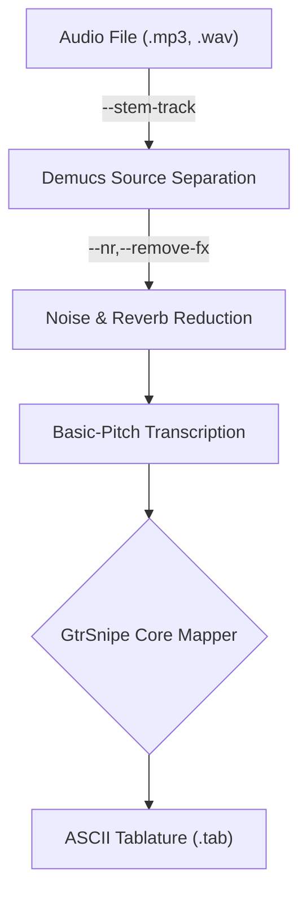

# gtrsnipe 
(pronounced "guttersnipe")

## V0.1.1
Convert to and from .mid, .abc, .vex, and .tab files. 

## V0.2.0]
Transcribe music for guitar, capable of converting audio files (.mp3, .wav), MIDI (.mid), and various text-based formats (.tab, .vex, .abc) into high-quality ASCII tablature. [Read about the current state of these new features](https://github.com/scottvr/gtrsnipe/wiki/v0.2.0)

### What?

gtrsnipe is a versatile music transcription tool. Its primary function is to create playable guitar tablature from a variety of sources. It features a sophisticated audio-to-tab pipeline that can take a mixed audio track, isolate the guitar part, and transcribe it into a tab.

It can also convert existing MIDI files into text-based notations or, in reverse, generate a playable MIDI file from a text-based tab.

At its core, gtrsnipe uses an intelligent fretboard mapper that analyzes notes and chords to find comfortable and logical fingerings on the guitar neck. [This process is highly customizable](https://github.com/scottvr/gtrsnipe/wiki/1.-FretboardMapper-Algorithm-Configuration-and-Tunables), allowing you to fine-tune the output to match your personal playing style and preferences.

-----
## The Audio-to-Tablature Pipeline

For audio files, gtrsnipe uses a multi-stage pipeline to process the sound and transcribe the notes. Each stage can be enabled or disabled via command-line flags.



---

# Installation

### Prerequisites

You must have a working Python programming language environment installed (from python.org or your system's software package manager) as well as `git` (from git-scm.com or your system's software package manager.)

### Procedure

It is highly recommended to install gtrsnipe within a python virtual environment.

```
git clone https://github.com/scottvr/gtrsnipe
cd gtrsnipe
python -mvenv .venv
```
Activate the environment:

on Windows: `.venv\Scripts\activate`
on MacOS/Linux: `. .venv/bin/activate`

Then, install the project and its dependencies:

```
pip install -e .
```

## Usage 

The installation process makes gtrsnipe available as a command within your activgated virtual environment.

### Command-line help

```
uusage: gtrsnipe [-h] [-i INPUT] [-o OUTPUT] [--capo CAPO]
                [--tuning {STANDARD,E_FLAT,DROP_D,OPEN_G,BASS_STANDARD,BASS_DROP_D,BASS_E_FLAT,SEVEN_STRING_STANDARD,BARITONE_B,BARITONE_A,BARITONE_C,C_SHARP,OPEN_C6,DROP_C,PIANO}]
                [--bass] [--num-strings {4,5,6,7}] [--max-fret MAX_FRET] [--mono-lowest-only] [--nr] [--remove-fx]
                [--stem-track {guitar,bass,drums,vocals,piano,other}] [--demucs-model DEMUCS_MODEL] [--constrain-frequency]
                [--min-note-override MIN_NOTE_OVERRIDE] [--max-note-override MAX_NOTE_OVERRIDE] [--low-pass-filter] [--onset-threshold ONSET_THRESHOLD]
                [--frame-threshold FRAME_THRESHOLD] [--min-note-len-ms MIN_NOTE_LEN_MS] [--melodia-trick] [--nudge NUDGE] [-y] [--track TRACK] [--analyze]
                [--transpose TRANSPOSE] [--no-articulations] [--staccato] [--max-line-width MAX_LINE_WIDTH] [--single-string {1,2,3,4,5,6}] [--constrain-pitch]    
                [--pitch-mode {drop,normalize}] [--debug] [--list-tunings] [--show-tuning TUNING_NAME] [--fret-span-penalty FRET_SPAN_PENALTY]
                [--movement-penalty MOVEMENT_PENALTY] [--string-switch-penalty STRING_SWITCH_PENALTY] [--high-fret-penalty HIGH_FRET_PENALTY]
                [--low-string-high-fret-multiplier LOW_STRING_HIGH_FRET_MULTIPLIER] [--unplayable-fret-span UNPLAYABLE_FRET_SPAN]
                [--sweet-spot-bonus SWEET_SPOT_BONUS] [--sweet-spot-low SWEET_SPOT_LOW] [--sweet-spot-high SWEET_SPOT_HIGH] [--ignore-open]
                [--legato-time-threshold LEGATO_TIME_THRESHOLD] [--tapping-run-threshold TAPPING_RUN_THRESHOLD] [--pre-quantize] [--dedupe]
                [--quantization-resolution {0.0125,0.0625,0.125,0.25,0.5,1.0}] [--prefer-open] [--fretted-open-penalty FRETTED_OPEN_PENALTY]
                [--barre-bonus BARRE_BONUS] [--barre-penalty BARRE_PENALTY] [--let-ring-bonus LET_RING_BONUS] [--count-fret-span-across-neighbors]

```

**options:**
-   `-h, --help`            show this help message and exit
-  `-i INPUT, --input INPUT`
                        Path to the input file (.mid, .mp3, .wav, etc.).
-  `-o OUTPUT, --output OUTPUT`
                        Path to the output file (.tab, .mid, etc.).
-  `--nudge NUDGE`         An integer to shift the transcription's start time to the right. Each unit corresponds to roughly a 16th note.
-  `-y, --yes`             Automatically overwrite the output file if it already exists.
-  `--track TRACK`         The track number (1-based) to select from a multi-track MIDI file. If not set, all tracks are processed. For a multitrack midi, you will   
                        want to select a single instrument track to transcribe.
-  `--analyze`             Analyze the input MIDI file to find the pitch range and suggest suitable tunings, then exit.
-  `--transpose TRANSPOSE`
                        Transpose the music up or down by N semitones (e.g., 2 for up, -3 for down).
-  `--no-articulations`    Transcribe with no legato, taps, hammer-ons, pull-offs, etc.
-  `--staccato`            Do not extend note durations to the start of the next note, instead giving each note an 1/8 note duration. When converting from ASCII      
                        tab.
-  `--max-line-width MAX_LINE_WIDTH`
                        Max number of vertical columns per line of ASCII tab. (default: 40)
-  `--single-string {1,2,3,4,5,6}`
                        Force all notes onto a single string (1-6, high e to low E). Ideal for transcribing legato/tapping runs.
-  `--constrain-pitch`     Constrain notes to the playable range of the tuning specified by --tuning.
-  `--pitch-mode {drop,normalize}`
                        Used with --constrain-pitch. 'drop' (default) discards out-of-range notes. 'normalize' transposes out-of-range notes by octaves until      
                        they fit.
-  `--debug`               Enable detailed debug logging messages.


**Audio-to-MIDI Pipeline Options:**
-  `--nr`                  Step 2: Enables noise/reverb reduction on the audio stem.
-  `--remove-fx`           Pre-process audio with a distortion recovery model before pitch detection.
-  `--stem-track {guitar,bass,drums,vocals,piano,other}`
                        The instrument stem to isolate with Demucs. 'guitar' defaults to the 'other' stem.
-  `--demucs-model DEMUCS_MODEL`
                        The demucs model to use for separation (e.g., htdemucs, htdemucs_fti, htdemucs_6s, mdx_extra).
-  `--constrain-frequency`
                        Constrain pitch detection to the frequency range of the selected tuning.
-  `--low-pass-filter`     Apply a low-pass filter to the audio stem based on the instrument's max frequency.
-  `--onset-threshold ONSET_THRESHOLD`
                        Basic-Pitch model's note onset threshold (0.0 to 1.0).
-  `--frame-threshold FRAME_THRESHOLD`
                        Basic-Pitch model's note frame threshold (0.0 to 1.0).
-  `--min-note-len-ms MIN_NOTE_LEN_MS`
                        Basic-Pitch's minimum note length in milliseconds to keep.
-  `--melodia-trick`       Enable Basic-Pitch's 'melodia trick'; whatever that is.

**Tuning Information:**
-  `--list-tunings`        List all available tuning names and exit.
-  `--show-tuning TUNING_NAME`
                        Show the notes for a specific tuning and exit.

**Mapper Tuning/Configuration (Advanced):**
-  `--fret-span-penalty FRET_SPAN_PENALTY`
                        Penalty for wide fret stretches (default: 100.0).
-  `--movement-penalty MOVEMENT_PENALTY`
                        Penalty for hand movement between chords (default: 3.0).
-  `--string-switch-penalty STRING_SWITCH_PENALTY`
                        Penalty for switching strings (default: 5.0).
-  `--high-fret-penalty HIGH_FRET_PENALTY`
                        Penalty for playing high on the neck (default: 5).
-  `--low-string-high-fret-multiplier LOW_STRING_HIGH_FRET_MULTIPLIER`
                        Multiplier penalty for playing high on the neck on low strings (default: 10).
-  `--unplayable-fret-span UNPLAYABLE_FRET_SPAN`
                        Fret span considered unplayable (default: 4).
-  `--sweet-spot-bonus SWEET_SPOT_BONUS`
                        Bonus for playing in the ideal lower fret range.
-  `--sweet-spot-low SWEET_SPOT_LOW`
                        Lowest fret of the "sweet spot" (default 0 - open)
-  `--sweet-spot-high SWEET_SPOT_HIGH`
                        Highest fret of the "sweet spot" (default 12)
-  `--ignore-open`         Don't consider open when calculating shape score.
-  `--legato-time-threshold LEGATO_TIME_THRESHOLD`
                        Max time in beats between notes for a legato phrase (h/p) (default: 0.5).
-  `--tapping-run-threshold TAPPING_RUN_THRESHOLD`
                        Min number of notes in a run to be considered for tapping (default: 2).
-  `--pre-quantize`        Force a pre-quantization pass, snapping all notes to the quantization grid before mapping.
-  `--dedupe`              Enable de-duplication of notes with the same pitch within a chord. Useful for cleaning up MIDI from non-guitar sources.
-  `--quantization-resolution {0.0125,0.0625,0.125,0.25,0.5,1.0}`
                        Quantization resolution. Used by the mapper to determine simultaneous sounding of notes (chords) and by the ascii tab generator mainly     
                        for spacing purposes.
-  `--prefer-open`         Prefer open strings over their fretted equivalents (e.g., open B over G-string fret 4).
-  `--fretted-open-penalty FRETTED_OPEN_PENALTY`
                        The penalty score applied to fretted notes that could be open strings (default: 20.0).
-  `--barre-bonus BARRE_BONUS`
                        Bonus awarded to fingerings that use a barre/single finger (default: 0.0).
-  `--barre-penalty BARRE_PENALTY`
                        Penalty applied to fingerings that use a barre/single finger (default: 0.0).
-  `--let-ring-bonus LET_RING_BONUS`
                        Bonus awarded for fingerings that allow previous notes to ring out (default: 0.0).
-  `--count-fret-span-across-neighbors`
                        Penalize fingerings with an unplayable fret span between consecutive notes.

**Instrument Options**
-   `--capo CAPO`           Specify a capo position. All fret numbers will be relative to the capo.
-   `--tuning {STANDARD,E_FLAT,DROP_D,OPEN_G,BASS_STANDARD,BASS_DROP_D,BASS_E_FLAT,SEVEN_STRING_STANDARD,BARITONE_B,BARITONE_A,BARITONE_C,C_SHARP,OPEN_C6,DROP_C,PIANO}`
                        Specify the guitar tuning or "PIANO" for full-range midi passthrough. (default: STANDARD).
-   `--bass`                Enable bass mode. Automatically uses bass tuning and a 4-string staff.
-   `--num-strings {4,5,6,7}`
                        Force the number of strings on the tab staff (4, 5, 6, or 7). Defaults to 4 for bass and 6 for guitar.
-   `--max-fret MAX_FRET`   Maximum fret number on the virtual guitar neck (default: 24).
-   `--mono-lowest-only`    Force monophonic output by keeping only the lowest note in any chord.
-   `--min-note-override MIN_NOTE_OVERRIDE`
                        Override the calculated lowest note for frequency constraining (e.g., 'E2'). Requires --constrain-frequency.
-   `--max-note-override MAX_NOTE_OVERRIDE`
                        Override the calculated highest note for frequency constraining (e.g., 'E4'). Requires --constrain-frequency.


## Usage Examples

**Full audio-to-tab transcription**

Run the complete pipeline on a mixed audio file to generate a tab tuned to Drop D.

[]`gtrsnipe -i x:\S.O.D.mp3 -o march_of_the_S.O.D.tab --bass --stem --stem-name bass --p2m --tuning DROP_D  -y`](https://github.com/scottvr/gtrsnipe/wiki/v0.2.0)

**Audio-to-MIDI only**

Extract the guitar part from a song and save it as a MIDI file, stopping the pipeline there.

`gtrsnipe -i "another_song.wav" -o "guitar_part.mid" --stem --p2m`

**Transcribing from Clean Audio**

If you already have a clean, isolated guitar track, you can skip the demucs and noise reduction steps.

`gtrsnipe -i "my_clean_riff.wav" -o "my_riff.tab" --p2m`

**MIDI-to-Tab (Classic V1 Functionality)**

[]`gtrsnipe -i "MrCrowley.mid" -o "mrcrowley.tab" --track 5`](https://github.com/scottvr/gtrsnipe/wiki/2.-Example-%E2%80%90-Mr-Crowley-organ-intro)

## Advanced Usage: Mapper & Demucs Tuning

The real power of gtrsnipe comes from its customizability. You can fine-tune the fretboard mapping algorithm and the audio separation models to get the perfect transcription. [Detailed documentation with troubleshooting examples are being created in the wiki.](https://github.com/scottvr/gtrsnipe/wiki/FretboardMapper-Algorithm-Configuration-and-Tunables)

**Demucs Model Selection** `(--demucs-model)`

Demucs is a state-of-the-art music source separation model. Several models are available, each with specific characteristics. Choosing the right one can significantly improve the quality of the isolated audio stem.

- **htdemucs**: The default Hybrid Transformer Demucs model. A great all-rounder.
- **htdemucs_ft**: A version of htdemucs fine-tuned on extra data. May offer better quality at the cost of speed.
- **htdemucs_6s**: A 6-source version that can additionally attempt to separate piano and guitar, though quality may vary.
- **hdemucs_mmi**: The v3 Hybrid Demucs model, retrained on more data.
- **mdx / mdx_extra**: Models known for high performance, trained on the MusDB HQ dataset.
- **mdx_q / mdx_extra_q**: Quantized (smaller, faster) versions of the mdx models, which may have slightly reduced quality.


### Current Supported Tunings

```
$ gtrsnipe  --list-tunings                                                   
Available Tunings:
- STANDARD              : E4 B3 G3 D3 A2 E2
- E_FLAT                : Eb4 Bb3 Gb3 Db3 Ab2 Eb2
- DROP_D                : E4 B3 G3 D3 A2 D2
- D_STANDARD            : D4 A3 F3 C3 G2 D2
- DROP_C                : D4 A3 F3 C3 G2 C2
- DROP_B                : C#4 F#3 B2 E2 B1
- OPEN_G                : D4 B3 G3 D3 G2 D2
- OPEN_E                : E4 B3 G#3 E3 B2 E2
- DADGAD                : D4 A3 G3 D3 A2 D2
- OPEN_D                : D4 A3 F#3 D3 A2 D2
- OPEN_C6               : E4 C4 G3 C3 A2 C2
- BASS_STANDARD         : G2 D2 A1 E1
- BASS_DROP_D           : G2 D2 A1 D1
- BASS_E_FLAT           : Gb2 Db2 Ab1 Eb1
- SEVEN_STRING_STANDARD : E4 B3 G3 D3 A2 E2 B1
- SEVEN_STRING_DROP_A   : E4 B3 G3 D3 A2 E2 A1
- BARITONE_B            : B3 F#3 D3 A2 E2 B1
- BARITONE_A            : A3 E3 C3 G2 D2 A1
- BARITONE_C            : C4 G3 Eb3 Bb2 F2 C2
```

# Other Examples
[All other examples and detailed usage information has been moved to the Wiki](https://github.com/scottvr/gtrsnipe/wiki)