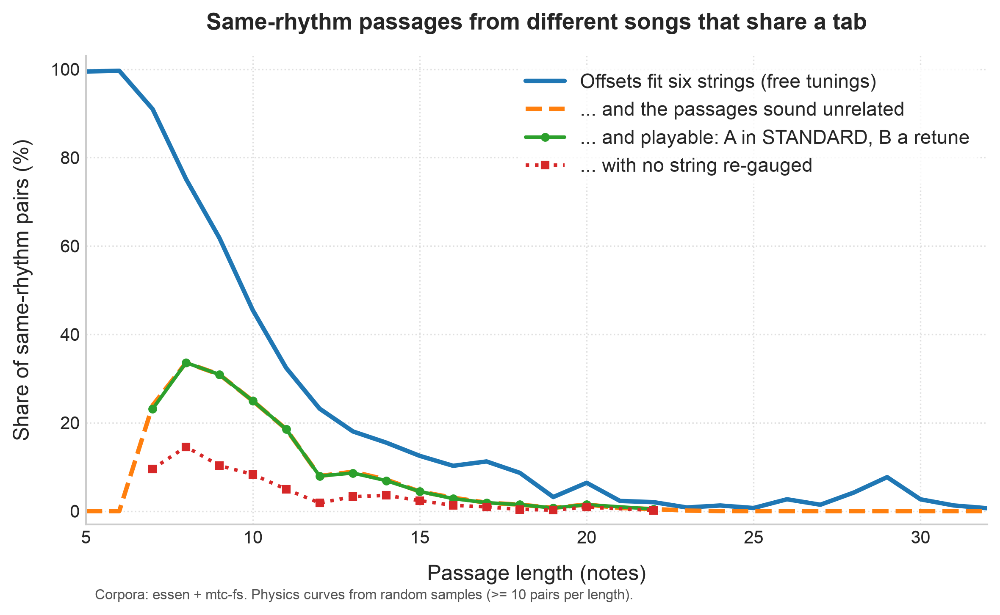
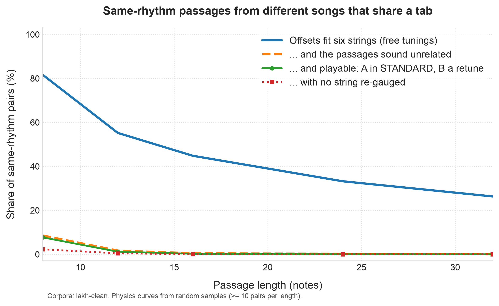

# R04: tab homographs in the wild

Run on 2026-09-26 with `gtrsnipe-research scan` (gtrsnipe 0.6.4). The question: **how often
can passages of two different songs be played from one and the same tab**, under different
tunings, on a real guitar?

```bash
gtrsnipe-research --data DIR scan essen mtc-fs --solve 40 --physics-sample 30 --tabs TABS --json folk.json
gtrsnipe-research --data DIR scan lakh-clean --named-melodies --unit window --window 16 \
    --min-keep-len 16 --solve 40 --physics-sample 30 --json lakh-16.json     # also 8, 12, 24, 32
python docs/dev/r04_plot.py folk.json --out folk.png
```

The shared tabs the scan writes contain the corpora's music, so they stay local, like the
golden cases. This note keeps only references (corpus:id@notes).

## Method

1. **Units.**
   - *Folk*: the phrases marked in the Essen Folksong Collection (8,472 tunes) and the Meertens
     Tune Collections MTC-FS-INST (18,109), 158,390 phrases of 5–64 notes.
   - *Pop*: 16-note (also 8/12/24/32-note) windows at a stride of 4 over the Lakh Clean MIDI
     songs whose melody comes from a track named for it: 5,021 songs by 1,189 artists. Songs
     whose melody would come from a skyline are left out.
2. **Alignment.** Two units can share a tab only if their notes pair one for one with the same
   rhythm, so units are bucketed by (length, inter-onset intervals divided by their gcd). The
   same figure at another note value counts as the same rhythm. No re-rhythming.
3. **Eligibility.** 2 ≤ richness ≤ 6: the note-for-note offsets fit six strings. Richness 1 is a
   plain transposition (a capo, not a homograph).
4. **Pairs that come for free are not evidence**, so these are counted, but excluded from the
   candidates:
   - *trivial*: at most 6 distinct aligned (A, B) pitch pairs. Richness can never exceed that
     count, so two repeated 6-note cells fit six strings at any length. The first Lakh run's
     "best" pair was exactly that: the intro arpeggio of *You Light Up My Life* against a
     repeated figure in *For Whom the Bell Tolls*.
   - *mechanical*: a phrase with ≤ 2 pitches; a figure repeating with period ≤ 6 (arpeggio,
     ostinato, Alberti bass); or broken chords, where under a quarter of the moves are steps.
     Same-quality chord shapes are transpositions of each other, so arpeggiated progressions
     collapse to a few offsets.
   - *same work*: another voice or stanza of one Meertens record, or a duplicate MIDI of one
     title. *Same tune family*: where labelled.
5. **Sounding unrelated.** No single transposition may explain half the notes (C₁ ≤ ½), *and*
   contour agreement (the share of consecutive moves in the same direction) must be ≤ 0.6. 86%
   of MTC-ANN phrase pairs from different tune families meet that. Without the contour
   condition, two descending scale runs in different modes pass as "different".
6. **Physics.** For 30 random unrelated-sounding eligible pairs per length, and for the 40 best
   pairs, the full homograph solver:
   - *anchored*: A stays an ordinary STANDARD tab, and B is a retune of the same guitar;
   - *middle*: both songs are retunes of one guitar;
   - both check string tension against D'Addario-calibrated limits (breaking, slack, and
     whether a string must be swapped for another gauge);
   - each tab it writes is re-decoded in both tunings and checked note for note.
7. **Ranking.** Candidates are ranked by the number of distinct aligned pitch pairs (how much
   coincidence the tab needs), then by length.

## Results

### Bottom line

- **Folk song: sharing a tab is common for short phrases, and rare but real for long ones.**
  - Among same-rhythm phrase pairs from different tunes, the share that fits six strings *and*
    sounds unrelated is about a third at 8–9 notes, 8% at 12, 3% at 16 and 1.5% at 20.
  - Put the other way: 84% of 8-note phrases, 45% of 12-note phrases and 14% of 16-note
    phrases have at least one such partner among the 26,581 tunes.
- **String tension barely filters, but comfort does.** At 7–20 notes the full solver places
  93–100% of the sampled pairs on a real guitar: an ordinary STANDARD tab of A, with B a
  retune of the same guitar.
  - For a quarter to a half of them, no string needs a different gauge.
  - But most of those tabs are awkward: big leaps, and usually fret 24. With a playability
    limit only a minority survive (see "Playability" below, added with F06 in v0.6.6).
  - Letting both songs retune one guitar ("middle") solves 100%.
  - Rhythm plus the offset count is the binding constraint, not the strings.
- **Pop melodies look easy, but are mostly trivial.**
  - 45% of same-rhythm 16-note Lakh window pairs fit six strings. But pop melodies circle a few
    pitches, so most of those pairs have at most 6 distinct pitch pairs, and fitting was
    automatic.
  - Pairs that are non-trivial and sound unrelated: 8.6% at 8 notes, 1.7% at 12, 0.5% at 16,
    0.05% at 32. Even the last is 4,467 pairs of 32-note passages from different songs.
- **The best examples need a human ear.** The filters remove what can be defined (repeated
  cells, arpeggios, transpositions, same-contour runs), and what remains is not always a
  *tune*. The best 32-note Lakh pair is a Garth Brooks chromatic climb against a chromatic
  line from Pink Floyd's *The Trial*.

### Folk song: Essen + MTC-FS-INST, marked phrases



Percentages are of same-rhythm pairs from different works; "partner" is the share of phrases
with at least one unrelated-sounding eligible partner. A dash (—) means the solver was not
sampled at that length.

| notes | pairs | eligible | trivial | unrelated-sounding | phrases with a partner | anchored solvable (no restring) | middle solvable (no restring) |
|---|---|---|---|---|---|---|---|
| 7 | 8,151,449 | 91.0% | 57.1% | 23.9% | 83.6% | 97% (40%) | 100% (70%) |
| 8 | 13,817,009 | 75.1% | 28.6% | 33.6% | 83.8% | 100% (43%) | 100% (70%) |
| 9 | 1,444,203 | 61.8% | 13.2% | 30.9% | 80.1% | 100% (33%) | 100% (60%) |
| 10 | 1,353,903 | 45.5% | 7.0% | 24.9% | 72.4% | 100% (33%) | 100% (57%) |
| 12 | 403,635 | 23.2% | 5.0% | 7.95% | 45.0% | 100% (23%) | 100% (43%) |
| 14 | 89,662 | 15.5% | 2.8% | 7.13% | 22.5% | 97% (50%) | 100% (43%) |
| 16 | 51,704 | 10.3% | 2.3% | 3.04% | 13.6% | 93% (43%) | 100% (43%) |
| 18 | 3,950 | 8.7% | 0.6% | 1.47% | 2.8% | 100% (27%) | 100% (23%) |
| 20 | 7,077 | 6.4% | 0.6% | 1.50% | 4.8% | 97% (60%) | 100% (37%) |
| 24 | 10,880 | 1.3% | 0.35% | 0.02% | 0.4% | — | — |

Phrases of 5–6 notes are always eligible (richness can't exceed the note count) and always
trivial, so the table starts at 7.

**Example** (the tab stays local): phrases of two titled Dutch songs from the Meertens
collection, *Als de zon komt uit haar kim gerezen* (NLB074456_01, notes 41–56) and *De meysjes
van het Eykenhout* (NLB134820_01, notes 17–32).
- They have 16 notes and 15 distinct pitch pairs, richness 6, C₁ = 0.31, and contour agreement
  0.40.
- An ordinary STANDARD tab of the first plays the second when the guitar is retuned to
  E♭2 F♯2 A2 G3 A3 F♯4, with no string re-gauged.
- The same tab decodes, note for note, to either song.

### Pop: Lakh Clean MIDI, melody-named tracks, sliding windows



| notes | pairs | eligible | trivial | unrelated-sounding | songs' windows with a partner | anchored (no restring) | middle (no restring) |
|---|---|---|---|---|---|---|---|
| 8 | 26,309,360 | 81.6% | 65.5% | 8.55% | 18.8% | 90% (27%) | 97% (63%) |
| 12 | 18,211,950 | 55.2% | 47.1% | 1.69% | 4.3% | 70% (27%) | 97% (60%) |
| 16 | 15,412,599 | 44.8% | 39.2% | 0.47% | 1.0% | 53% (17%) | 93% (30%) |
| 24 | 10,354,733 | 33.2% | 28.5% | 0.23% | 0.3% | 23% (0%) | 93% (37%) |
| 32 | 8,138,886 | 26.3% | 22.4% | 0.05% | 0.2% | 30% (7%) | 93% (10%) |

- **Physics.** Pop passages are harder for the anchored mode than folk phrases: they span more,
  so a fixed STANDARD tab of A leaves fewer ways to retune. Letting both songs retune one
  guitar still solves over 90%.
- **Sampled buckets.** Rhythm buckets of more than 6,000 windows (e.g. running eighths) were
  randomly subsampled. That skipped 49.9 million pairs at 8 notes and 6.4 million at 12, and the
  scan output says so. The percentages are over the pairs compared.
- **Named songs** among the top candidates:
  - 16 notes: Huey Lewis & the News, *The Power of Love*, and the Surfaris, *Wipe Out*.
  - 24 notes: Lionel Richie, *My Love*, and Tears for Fears, *Everybody Wants to Rule the
    World*.
  - These are pairs of MIDI transcriptions from the web, and should be checked against the
    records before anyone quotes them.

## Playability (added in v0.6.6, F06)

The solver scores each shared tab against the tab gtrsnipe writes for song A alone, in the
same tuning and key. *Discomfort* is how many mapper points per note worse the shared tab is.
With default weights that's mostly hand movement (3 points per fret shifted between notes)
and high-fret penalties. A's own best tab typically scores −2 to −7 per note. On 50 random
unrelated-sounding eligible folk pairs from the samples above:

| | anchored tabs found | notes |
|---|---|---|
| no limit | 49/50 | median discomfort ≈ 100 points per note, top fret usually 24 |
| ≤ 50 points per note (about a 17-fret leap per note) | 19/50 | median top fret 19 (measured in the shallower search) |
| ≤ 20 | 4/50 | |
| ≤ 5 | 0/50 | |

So the earlier "the solver places 93–100% on a real guitar" is true of *string tension*, not
of comfort. A comfortable homograph (within a few points of A's own tab) was not found for any
sampled pair. These counts are lower bounds:
- the solver fingers at most 1,024 placements per mode;
- a class may use only its assigned strings plus one spare (see DESIGN-homograph
  "Playability").

For the argument, this doesn't change existence: these are valid, fingerable tabs. It does
mean that a *practical* demonstration needs hand-picked pairs and `--homograph-max-discomfort`.

## Caveats

- **Sources.**
  - The Lakh MIDI files are fan transcriptions, and a track named "Melody" or "Vocal" is not
    always the sung melody.
  - Essen and Meertens are scholarly transcriptions, but Meertens FS-INST includes many
    instrumental dance tunes (minuets, marches), which dominate the top of the folk list.
- **Rhythm.** Identical or proportional rhythms only. Re-rhythming (`--homograph-subdivide`,
  slop ratios) would find more.
- **"Sounds unrelated"** is two proxies (C₁ and contour). Pairs that pass can still share a key,
  a register or a style, as the two Dutch songs do.
- **Playability.** The solver is correct but not tasteful: it happily reaches fret 24 on the low
  strings. Ranking by playability is parked for later.
- **Units.** Phrases are the corpus's own. Windows are fixed-length at a stride of 4, so a
  shared passage longer than the window is found in pieces.

