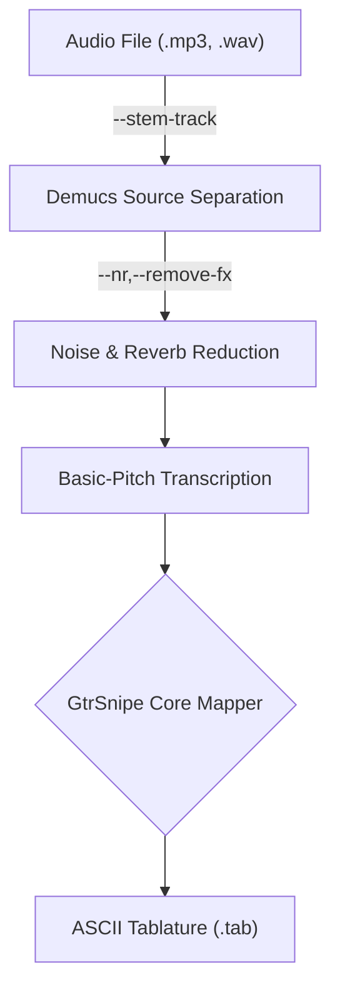

# Toward becoming a Swiss-Army knife of transcription.

A common question when I released gtrsnipe v0.1 was "so can it listen to music and transcribe a guitar tab?" and my answer was of course, "Not quite. It reads MIDI data and maps notes to the fretboard and generates playable tabs, but you have to have a good source MIDI to start with." The fingering and fretting algorithm (the Fretboard Mapper) is something to be proud of on its own, but it was obvious that what people really wanted was the ability to feed in a fully-mixed song and get an accurate and playable tab as output.

So after describing to people that there were programs, services, and many manual steps one could take to *get* such behavior, with gtrsnipe serving only as the "last mile" that does the actual ASCII TAB generation from musical data (not audio), I kept feeling a bit guilty and ashamed that gtrsnipe couldn't be this amazing magical tool people were imagining. So i started working on V0.2.0. The architecture of which looks something like this:



It's not ready for prime time yet, but I wanted to sort of keep a log of where it's at and how it's going so I started this wiki page and will share the first "successful" (depending on your definition of success of course) Proof of Concept audio-to-tablature by way of **gtrsnipe v0.2.0**

## Stormtroopers of Death

Because of course the March of the S.O.D. was the first song to come to my mind to try to bring from audio to tablature. But first things first, we need to strip it down to instrument tracks, even though all we have is the already mixed now-40-year-old album to work with. It came to mind likely because I had just finished adding a bunch of alternate tunings to gtrsnipe v0.1.1 and I wanted to see how the DROP_D tuning would transcribe. So, first we need to separate the guitar from the drums and bass. 

[Here's the original track (mp3)](https://paperclipmaximizer.ai/S.O.D./March_of_the_S.O.D.mp3)

A classic. The guitar is drop_d power chords so it should be rather simple I would think. Or I thought. Well, I knew better.. it isn't *simple*; it's a very complex and non-trivial process to separate an audio wave into multiple component waves based on the instrumentation and have it not sound like shit. gtrsnipe is using the [Demucs, originating out of Meta](https://arxiv.org/abs/2211.08553) Hybrid Transformer ML model for this task. Let's see what we got when we tried to isolate just the heavy, distorted guitar from our S.O.D. track using the following command:

```
$ gtrsnipe -i March_of_the_S.O.D.mp3 --tuning DROP_D -o S.O.D.tab
```

[S.O.D. - guitar only (mp3)](https://paperclipmaximizer.ai/S.O.D./sod-gtr-em.mp3)

It's a really decent job of "removing" the bass and drums, but that overdrive is so harmonic-rich, I knew I was going to get a messy MIDI out of it. But first I had to be able to convert that audio file into MIDI notes in the first place, which gtrsnipe v0.1.1 could not do. Enter [Basic Pitch, from Spotify's Audio Intelligence Lab](https://github.com/spotify/basic-pitch?tab=readme-ov-file). We know that gtrsnipe can make a great tab out of a good mid, but what sort of .mid would we get using a Basic Pitch ML model? Well, all of those harmonics got interpreted as their own notes and the resultant MIDI file was such a trainwreck, I have rendered [part of it using a cheesy default Windows midi piano synth sound. (mp3)](https://paperclipmaximizer.ai/S.O.D./sod-piano-silliness.mp3) :-) The timing sucks, and there are quite a few notes missing.

## Try #2 - Bass.

Surely the bass part, which is largely just playing single monophonic pitches at a time would be an easier win in the audio-to-midi department. [Here's the isolated bass part, using the demarcs_s6 model (mp3)](https://paperclipmaximizer.ai/S.O.D./sod-bass.mp3)  Sounds pretty decent, but there is a lot of mud, distortion, and just general rage and mayhem going on in that simple bass part. So how did the MIDI turn out? It fared, well... better, with the following gtrsnipe command-line:

```
gtrsnipe -i x:\S.O.D.mp3 -o sod-bass.tab --bass  --tuning BASS_DROP_D --stem --stem-name bass --constrain-frequency --min-note-override C2 --max-note-override B2 -y --mono-lowest-only  --transpose -12 --no-articulations
```

In fact, the resultant MIDI track was recognizable enough that I rendered a few seconds of the MIDI conversion of the extracted bass stem using a synth called Modo Bass and it *almost* sounds halfway decent. Again, it's [missing quite a few notes and the rhythm is wonky (mp3)](https://paperclipmaximizer.ai/S.O.D./sod-bass-to-midi-synth.mp3) It sounds a lot like someone who just got their first bass guitar trying to learn the song.

OK, so we have proofs of concept that we can go from mixed song, to instrumental tracks, to MIDI - even if the results aren't great. But what about that last mile? The entire thing gtrsnipe was already good at - making ASCII tab transcriptions? How did the bass tab turn out? Not completely awful!

```
// Tuning (High to Low): G2 D2 A1 D1


G|-------------------------------------|---------------------------------------|
D|-------------------------------------|---------------------------------------|
A|-------------------------------------|-----------------------------------0---|
D|---1---1----0--0----0--0----3--3----3|---2--2----0--0--0--1---1--1--0-------0|
```

## Third time's the charm
aka [More Bass](https://github.com/scottvr/gtrsnipe/wiki/gtrsnipe's-first-real-success-transcribing-AUDIO-to-Tablature!-Barney-Miller-Theme)


## Near Future

There is still a ways to go, but there, with one command, we got a nice isolated bass audio file to practice along with, and a passable ASCII bass TAB with **gtrsnipe V0.2.0**. I'll keep working at it and with any luck, we really will have that magical tool everyone with any interest in this stuff was asking about. In the meantime, I have started more [thorough documentation of the FretboardMapper algorithm and how you can tweak the weights, bonuses, and penalties to suit your preference when generating a tab.](https://github.com/scottvr/gtrsnipe/wiki/1.-FretboardMapper-Algorithm-Configuration-and-Tunables)

